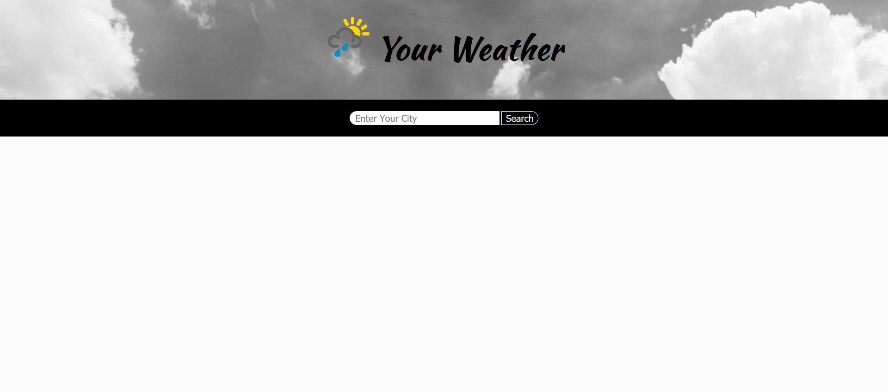
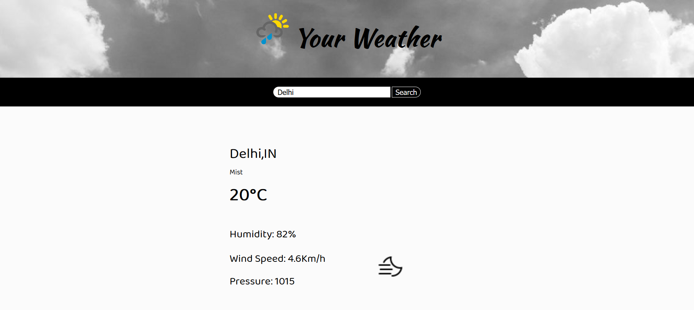

# Your-Weather
Your Weather is a weather app, which will tell you the weather of all the cities in the world. 
Application is made by using public API of openweathermap current weather API in which the JSON 
data will be passed and used in the FrontEnd of the application. 
## Features:-
1. Weather
2. Temprature
3. Wind Speed
4. Pressure
5. Humidity

In this you can easily search your city and get the weather condition right away.

## Some Shots :-
# Landing Page 

# Weather Page

## How to run it on your system ?
Just clone the repository and open the index.html file in browser or if you are using VS code,
then you can open it through live server
